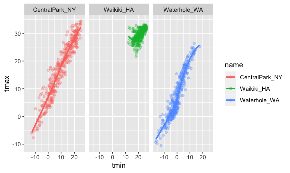

Visualization and EDA
================
Anyu Zhu
10/5/2021

Load a dataset

``` r
weather_df = 
  rnoaa::meteo_pull_monitors(
    c("USW00094728", "USC00519397", "USS0023B17S"),
    var = c("PRCP", "TMIN", "TMAX"), 
    date_min = "2017-01-01",
    date_max = "2017-12-31") %>%
  mutate(
    name = recode(
      id, 
      USW00094728 = "CentralPark_NY", 
      USC00519397 = "Waikiki_HA",
      USS0023B17S = "Waterhole_WA"),
    tmin = tmin / 10,
    tmax = tmax / 10) %>%
  select(name, id, everything())
```

    ## Registered S3 method overwritten by 'hoardr':
    ##   method           from
    ##   print.cache_info httr

    ## using cached file: ~/Library/Caches/R/noaa_ghcnd/USW00094728.dly

    ## date created (size, mb): 2021-10-05 10:29:26 (7.602)

    ## file min/max dates: 1869-01-01 / 2021-10-31

    ## using cached file: ~/Library/Caches/R/noaa_ghcnd/USC00519397.dly

    ## date created (size, mb): 2021-10-05 10:29:30 (1.697)

    ## file min/max dates: 1965-01-01 / 2020-02-29

    ## using cached file: ~/Library/Caches/R/noaa_ghcnd/USS0023B17S.dly

    ## date created (size, mb): 2021-10-05 10:29:32 (0.912)

    ## file min/max dates: 1999-09-01 / 2021-09-30

## Scatter Plot

tmax vs tmin

``` r
weather_df %>% 
  ggplot(aes(x = tmin, y = tmax)) + 
  geom_point()
```

    ## Warning: Removed 15 rows containing missing values (geom_point).


can save ggplots

``` r
ggp_tmax_tmin = weather_df %>% 
  ggplot(aes(x = tmin, y = tmax)) + 
  geom_point()

ggp_tmax_tmin
```

    ## Warning: Removed 15 rows containing missing values (geom_point).


``` r
# ggsave(ggp_tmax_tmin)
```

## Fancy it up

Add colors, lines, etc,

``` r
weather_df %>% 
  ggplot(aes(x = tmin, y = tmax, color = name)) + # color globally
  geom_point(alpha = 0.3) + # transparency of points
  geom_smooth(se = FALSE)
```

    ## `geom_smooth()` using method = 'loess' and formula 'y ~ x'

    ## Warning: Removed 15 rows containing non-finite values (stat_smooth).

    ## Warning: Removed 15 rows containing missing values (geom_point).


``` r
weather_df %>% 
  ggplot(aes(x = tmin, y = tmax)) + 
  geom_point(aes(color = name), alpha = 0.3) + # color only to points
  geom_smooth(se = FALSE)
```

    ## `geom_smooth()` using method = 'gam' and formula 'y ~ s(x, bs = "cs")'

    ## Warning: Removed 15 rows containing non-finite values (stat_smooth).

    ## Warning: Removed 15 rows containing missing values (geom_point).


``` r
weather_df %>% 
  ggplot(aes(x = tmin, y = tmax, color = name)) + 
  geom_point(alpha = 0.3) + 
  geom_smooth(se = FALSE) + 
  facet_grid(. ~ name)
```

    ## `geom_smooth()` using method = 'loess' and formula 'y ~ x'

    ## Warning: Removed 15 rows containing non-finite values (stat_smooth).

    ## Warning: Removed 15 rows containing missing values (geom_point).


One more scatter plot

``` r
weather_df %>% 
  ggplot(aes(x = date, y = tmax)) +
  geom_point(alpha = 0.3) +
  facet_grid(. ~ name) +
  geom_smooth(se = FALSE) # se = TRUE give confidence interval
```

    ## `geom_smooth()` using method = 'loess' and formula 'y ~ x'

    ## Warning: Removed 3 rows containing non-finite values (stat_smooth).

    ## Warning: Removed 3 rows containing missing values (geom_point).


## Use data manipulation as part of this

``` r
weather_df %>% 
  filter(name == "CentralPark_NY") %>% 
  mutate(tmax = tmax * (9/5) + 32,
         tmin = tmin * (9/5) + 32) %>% 
  ggplot(aes(x = tmin, y = tmax)) +
  geom_point()
```


## Stacking geoms

``` r
weather_df %>% 
  ggplot(aes(x = date, y = tmax, color = name)) +
  geom_smooth()
```

    ## `geom_smooth()` using method = 'loess' and formula 'y ~ x'

    ## Warning: Removed 3 rows containing non-finite values (stat_smooth).


``` r
ggplot(weather_df, aes(x = tmax, y = tmin)) + 
  geom_hex()
```

    ## Warning: Removed 15 rows containing non-finite values (stat_binhex).


## Univariate Plots

``` r
weather_df %>% 
  ggplot(aes(x = tmax, fill = name)) +
  geom_histogram() + 
  facet_grid(. ~ name)
```

    ## `stat_bin()` using `bins = 30`. Pick better value with `binwidth`.

    ## Warning: Removed 3 rows containing non-finite values (stat_bin).


``` r
weather_df %>% 
  ggplot(aes(x = tmax, fill = name)) +
  geom_density(alpha = 0.3)
```

    ## Warning: Removed 3 rows containing non-finite values (stat_density).


Box plot

``` r
weather_df %>% 
  ggplot(aes(x = name, y = tmax)) + 
  geom_boxplot()
```

    ## Warning: Removed 3 rows containing non-finite values (stat_boxplot).


Violin plot

``` r
weather_df %>% 
  ggplot(aes(x = name, y = tmax)) + 
  geom_violin()
```

    ## Warning: Removed 3 rows containing non-finite values (stat_ydensity).


Without ridges

``` r
weather_df %>% 
  ggplot(aes(x = tmax, y = name)) + 
  geom_density_ridges(alpha = 0.8, scale = 0.8)
```

    ## Picking joint bandwidth of 1.84

    ## Warning: Removed 3 rows containing non-finite values (stat_density_ridges).


## Embedding plots

``` r
weather_plot = ggplot(weather_df, aes(x = tmin, y = tmax)) + 
  geom_point(aes(color = name), alpha = .5) 
weather_plot
```

    ## Warning: Removed 15 rows containing missing values (geom_point).


## Start with a familiar one

``` r
weather_df %>% 
  ggplot(aes(x = tmin, y = tmax, color = name)) +
  geom_point(alpha = 0.3) +
  labs(
    title = "Temperature at three stations",
    x = "Minimum daily temp (C)",
    y = "Maximum daily temp (C)",
    caption = "Data from package rnoaa with three stations" 
  )
```

    ## Warning: Removed 15 rows containing missing values (geom_point).


## Scales

``` r
weather_df %>% 
  ggplot(aes(x = tmin, y = tmax, color = name)) +
  geom_point(alpha = 0.3) +
  labs(
    title = "Temperature at three stations",
    x = "Minimum daily temp (C)",
    y = "Maximum daily temp (C)",
    caption = "Data from package rnoaa with three stations" 
  ) +
  scale_x_continuous(
    breaks = c(-15, 0, 15),
    labels = c("-15 C", "0", "15")
  ) +
  scale_y_continuous(
    trans = "sqrt",
    position = "right" # label on the right
  )
```

    ## Warning in self$trans$transform(x): NaNs produced

    ## Warning: Transformation introduced infinite values in continuous y-axis

    ## Warning: Removed 90 rows containing missing values (geom_point).


Color Scales

``` r
weather_df %>% 
  ggplot(aes(x = tmin, y = tmax, color = name)) +
  geom_point(alpha = 0.3) +
  labs(
    title = "Temperature at three stations",
    x = "Minimum daily temp (C)",
    y = "Maximum daily temp (C)",
    caption = "Data from package rnoaa with three stations" 
  ) +
  scale_color_hue(
    name = "Location", # change legend title
    h = c(100, 300)) +
  scale_color_viridis_d()
```

    ## Scale for 'colour' is already present. Adding another scale for 'colour',
    ## which will replace the existing scale.

    ## Warning: Removed 15 rows containing missing values (geom_point).


``` r
# https://cran.r-project.org/web/packages/viridis/vignettes/intro-to-viridis.html
```

## Themes

``` r
weather_df %>% 
  ggplot(aes(x = tmin, y = tmax, color = name)) +
  geom_point(alpha = 0.3) +
  labs(
    title = "Temperature at three stations",
    x = "Minimum daily temp (C)",
    y = "Maximum daily temp (C)",
    caption = "Data from package rnoaa with three stations" 
  ) +
  scale_color_hue(
    name = "Location", # change label name
    h = c(100, 300)) +
  scale_color_viridis_d() +
  theme_minimal() + # background; do this first!! then update other themes
  theme(legend.position = "bottom")
```

    ## Scale for 'colour' is already present. Adding another scale for 'colour',
    ## which will replace the existing scale.

    ## Warning: Removed 15 rows containing missing values (geom_point).


``` r
weather_df %>% 
  ggplot(aes(x = tmin, y = tmax, color = name)) +
  geom_point(alpha = 0.3) +
  labs(
    title = "Temperature at three stations",
    x = "Minimum daily temp (C)",
    y = "Maximum daily temp (C)",
    caption = "Data from package rnoaa with three stations" 
  ) +
  scale_color_hue(
    name = "Location", # change label name
    h = c(100, 300)) +
  scale_color_viridis_d() + 
  ggthemes::theme_excel() +
  theme(legend.position = "bottom")
```

    ## Scale for 'colour' is already present. Adding another scale for 'colour',
    ## which will replace the existing scale.

    ## Warning: Removed 15 rows containing missing values (geom_point).


## data in geoms

``` r
central_park = 
  weather_df %>% 
  filter(name == "CentralPark_NY")

waikiki = 
  weather_df %>% 
  filter(name == "Waikiki_HA")

weather_df %>% 
  ggplot(aes(x = date, y = tmax, color = name)) +
  geom_point()
```

    ## Warning: Removed 3 rows containing missing values (geom_point).


``` r
waikiki %>% 
  ggplot(aes(x = date, y = tmax, color = name)) + 
  geom_point() + 
  geom_line(data = central_park)
```

    ## Warning: Removed 3 rows containing missing values (geom_point).


## `patchwork`

``` r
ggp_tmax_tmin = 
  weather_df %>% 
  ggplot(aes(x = tmin, y = tmax, color = name)) +
  geom_point(alpha = 0.3)

ggp_prcp_dens = 
  weather_df %>% 
  filter(prcp > 0) %>% 
  ggplot(aes(x = prcp, fill = name)) +
  geom_density(alpha = 0.3)

ggp_tmax_date = 
  weather_df %>% 
  ggplot(aes(x = date, y = tmax, color = name)) +
  geom_point() +
  geom_smooth(se = FALSE)

(ggp_tmax_tmin + ggp_prcp_dens) / (ggp_tmax_date) # patchwork
```

    ## Warning: Removed 15 rows containing missing values (geom_point).

    ## `geom_smooth()` using method = 'loess' and formula 'y ~ x'

    ## Warning: Removed 3 rows containing non-finite values (stat_smooth).

    ## Warning: Removed 3 rows containing missing values (geom_point).


## data manipulation

examples on factor

``` r
weather_df %>% 
  mutate(
    name = fct_reorder(name, tmax) # order according to values; default: alphabetic
  ) %>% 
  ggplot(aes(x = name, y = tmax, fill = name)) +
    geom_boxplot()
```

    ## Warning: Removed 3 rows containing non-finite values (stat_boxplot).


About tmax and tmin

``` r
weather_df %>% 
  pivot_longer(
    tmax:tmin,
    names_to = "observations",
    values_to = "temperature"
  ) %>% 
  ggplot(aes(x = temperature, fill = observations)) +
  geom_density(alpha = 0.3) +
  facet_grid(. ~ name)
```

    ## Warning: Removed 18 rows containing non-finite values (stat_density).


``` r
pulse_df = haven::read_sas("data/public_pulse_data.sas7bdat") %>% 
  janitor::clean_names() %>% 
  pivot_longer(
    bdi_score_bl:bdi_score_12m,
    names_to = "visit",
    values_to = "bdi",
    names_prefix = "bdi_score_"
  ) %>% 
  mutate(visit = recode(visit, "bl" = "00m"))

pulse_df %>% 
  ggplot(aes(x = visit, y = bdi)) +
  geom_boxplot()
```

    ## Warning: Removed 879 rows containing non-finite values (stat_boxplot).


Longitudinal analysis

``` r
pulse_df %>% 
  ggplot(aes(x = visit, y = bdi))+
  geom_point() + 
  geom_line(aes(group = id), alpha = 0.3) # keep track of each person
```

    ## Warning: Removed 879 rows containing missing values (geom_point).

    ## Warning: Removed 515 row(s) containing missing values (geom_path).


