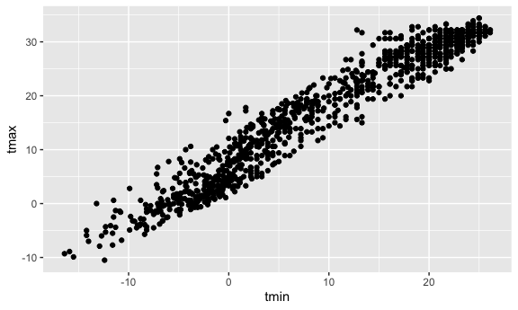
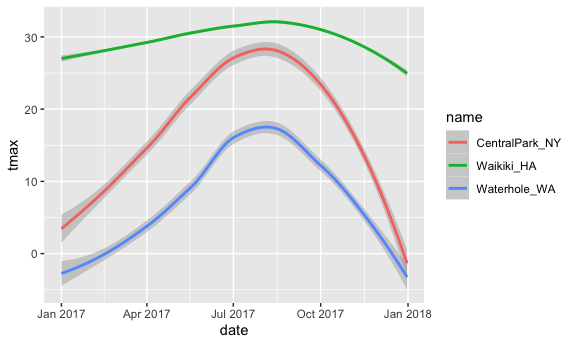

Visualization and EDA
================
Anyu Zhu
10/5/2021

Load a dataset

``` r
weather_df = 
  rnoaa::meteo_pull_monitors(
    c("USW00094728", "USC00519397", "USS0023B17S"),
    var = c("PRCP", "TMIN", "TMAX"), 
    date_min = "2017-01-01",
    date_max = "2017-12-31") %>%
  mutate(
    name = recode(
      id, 
      USW00094728 = "CentralPark_NY", 
      USC00519397 = "Waikiki_HA",
      USS0023B17S = "Waterhole_WA"),
    tmin = tmin / 10,
    tmax = tmax / 10) %>%
  select(name, id, everything())
```

    ## Registered S3 method overwritten by 'hoardr':
    ##   method           from
    ##   print.cache_info httr

    ## using cached file: ~/Library/Caches/R/noaa_ghcnd/USW00094728.dly

    ## date created (size, mb): 2021-10-05 10:29:26 (7.602)

    ## file min/max dates: 1869-01-01 / 2021-10-31

    ## using cached file: ~/Library/Caches/R/noaa_ghcnd/USC00519397.dly

    ## date created (size, mb): 2021-10-05 10:29:30 (1.697)

    ## file min/max dates: 1965-01-01 / 2020-02-29

    ## using cached file: ~/Library/Caches/R/noaa_ghcnd/USS0023B17S.dly

    ## date created (size, mb): 2021-10-05 10:29:32 (0.912)

    ## file min/max dates: 1999-09-01 / 2021-09-30

## Scatter Plot

tmax vs tmin

``` r
weather_df %>% 
  ggplot(aes(x = tmin, y = tmax)) + 
  geom_point()
```

    ## Warning: Removed 15 rows containing missing values (geom_point).


can save ggplots

``` r
ggp_tmax_tmin = weather_df %>% 
  ggplot(aes(x = tmin, y = tmax)) + 
  geom_point()

ggp_tmax_tmin
```

    ## Warning: Removed 15 rows containing missing values (geom_point).


``` r
# ggsave(ggp_tmax_tmin)
```

## Fancy it up

Add colors, lines, etc,

``` r
weather_df %>% 
  ggplot(aes(x = tmin, y = tmax, color = name)) + # color globally
  geom_point(alpha = 0.3) + # transparency of points
  geom_smooth(se = FALSE)
```

    ## `geom_smooth()` using method = 'loess' and formula 'y ~ x'

    ## Warning: Removed 15 rows containing non-finite values (stat_smooth).

    ## Warning: Removed 15 rows containing missing values (geom_point).


``` r
weather_df %>% 
  ggplot(aes(x = tmin, y = tmax)) + 
  geom_point(aes(color = name), alpha = 0.3) + # color only to points
  geom_smooth(se = FALSE)
```

    ## `geom_smooth()` using method = 'gam' and formula 'y ~ s(x, bs = "cs")'

    ## Warning: Removed 15 rows containing non-finite values (stat_smooth).

    ## Warning: Removed 15 rows containing missing values (geom_point).


``` r
weather_df %>% 
  ggplot(aes(x = tmin, y = tmax, color = name)) + 
  geom_point(alpha = 0.3) + 
  geom_smooth(se = FALSE) + 
  facet_grid(. ~ name)
```

    ## `geom_smooth()` using method = 'loess' and formula 'y ~ x'

    ## Warning: Removed 15 rows containing non-finite values (stat_smooth).

    ## Warning: Removed 15 rows containing missing values (geom_point).


One more scatter plot

``` r
weather_df %>% 
  ggplot(aes(x = date, y = tmax)) +
  geom_point(alpha = 0.3) +
  facet_grid(. ~ name) +
  geom_smooth(se = FALSE) # se = TRUE give confidence interval
```

    ## `geom_smooth()` using method = 'loess' and formula 'y ~ x'

    ## Warning: Removed 3 rows containing non-finite values (stat_smooth).

    ## Warning: Removed 3 rows containing missing values (geom_point).


## Use data manipulation as part of this

``` r
weather_df %>% 
  filter(name == "CentralPark_NY") %>% 
  mutate(tmax = tmax * (9/5) + 32,
         tmin = tmin * (9/5) + 32) %>% 
  ggplot(aes(x = tmin, y = tmax)) +
  geom_point()
```


## Stacking geoms

``` r
weather_df %>% 
  ggplot(aes(x = date, y = tmax, color = name)) +
  geom_smooth()
```

    ## `geom_smooth()` using method = 'loess' and formula 'y ~ x'

    ## Warning: Removed 3 rows containing non-finite values (stat_smooth).



``` r
ggplot(weather_df, aes(x = tmax, y = tmin)) + 
  geom_hex()
```

    ## Warning: Removed 15 rows containing non-finite values (stat_binhex).


## Univariate Plots

``` r
weather_df %>% 
  ggplot(aes(x = tmax, fill = name)) +
  geom_histogram() + 
  facet_grid(. ~ name)
```

    ## `stat_bin()` using `bins = 30`. Pick better value with `binwidth`.

    ## Warning: Removed 3 rows containing non-finite values (stat_bin).


``` r
weather_df %>% 
  ggplot(aes(x = tmax, fill = name)) +
  geom_density(alpha = 0.3)
```

    ## Warning: Removed 3 rows containing non-finite values (stat_density).


Box plot

``` r
weather_df %>% 
  ggplot(aes(x = name, y = tmax)) + 
  geom_boxplot()
```

    ## Warning: Removed 3 rows containing non-finite values (stat_boxplot).


Violin plot

``` r
weather_df %>% 
  ggplot(aes(x = name, y = tmax)) + 
  geom_violin()
```

    ## Warning: Removed 3 rows containing non-finite values (stat_ydensity).


Without ridges

``` r
weather_df %>% 
  ggplot(aes(x = tmax, y = name)) + 
  geom_density_ridges(alpha = 0.8, scale = 0.8)
```

    ## Picking joint bandwidth of 1.84

    ## Warning: Removed 3 rows containing non-finite values (stat_density_ridges).


## Embedding plots

``` r
weather_plot = ggplot(weather_df, aes(x = tmin, y = tmax)) + 
  geom_point(aes(color = name), alpha = .5) 
weather_plot
```

    ## Warning: Removed 15 rows containing missing values (geom_point).


## Start with a familiar one

``` r
weather_df %>% 
  ggplot(aes(x = tmin, y = tmax, color = name)) +
  geom_point(alpha = 0.3) +
  labs(
    title = "Temperature at three stations",
    x = "Minimum daily temp (C)",
    y = "Maximum daily temp (C)",
    caption = "Data from package rnoaa with three stations" 
  )
```

    ## Warning: Removed 15 rows containing missing values (geom_point).


## Scales

``` r
weather_df %>% 
  ggplot(aes(x = tmin, y = tmax, color = name)) +
  geom_point(alpha = 0.3) +
  labs(
    title = "Temperature at three stations",
    x = "Minimum daily temp (C)",
    y = "Maximum daily temp (C)",
    caption = "Data from package rnoaa with three stations" 
  ) +
  scale_x_continuous(
    breaks = c(-15, 0, 15),
    labels = c("-15 C", "0", "15")
  ) +
  scale_y_continuous(
    trans = "sqrt",
    position = "right" # label on the right
  )
```

    ## Warning in self$trans$transform(x): NaNs produced

    ## Warning: Transformation introduced infinite values in continuous y-axis

    ## Warning: Removed 90 rows containing missing values (geom_point).


Color Scales

``` r
weather_df %>% 
  ggplot(aes(x = tmin, y = tmax, color = name)) +
  geom_point(alpha = 0.3) +
  labs(
    title = "Temperature at three stations",
    x = "Minimum daily temp (C)",
    y = "Maximum daily temp (C)",
    caption = "Data from package rnoaa with three stations" 
  ) +
  scale_color_hue(
    name = "Location", # change legend title
    h = c(100, 300)) +
  scale_color_viridis_d()
```

    ## Scale for 'colour' is already present. Adding another scale for 'colour',
    ## which will replace the existing scale.

    ## Warning: Removed 15 rows containing missing values (geom_point).


``` r
# https://cran.r-project.org/web/packages/viridis/vignettes/intro-to-viridis.html
```

## Themes

``` r
weather_df %>% 
  ggplot(aes(x = tmin, y = tmax, color = name)) +
  geom_point(alpha = 0.3) +
  labs(
    title = "Temperature at three stations",
    x = "Minimum daily temp (C)",
    y = "Maximum daily temp (C)",
    caption = "Data from package rnoaa with three stations" 
  ) +
  scale_color_hue(
    name = "Location", # change label name
    h = c(100, 300)) +
  scale_color_viridis_d() +
  theme_minimal() + # background; do this first!! then update other themes
  theme(legend.position = "bottom")
```

    ## Scale for 'colour' is already present. Adding another scale for 'colour',
    ## which will replace the existing scale.

    ## Warning: Removed 15 rows containing missing values (geom_point).


``` r
weather_df %>% 
  ggplot(aes(x = tmin, y = tmax, color = name)) +
  geom_point(alpha = 0.3) +
  labs(
    title = "Temperature at three stations",
    x = "Minimum daily temp (C)",
    y = "Maximum daily temp (C)",
    caption = "Data from package rnoaa with three stations" 
  ) +
  scale_color_hue(
    name = "Location", # change label name
    h = c(100, 300)) +
  scale_color_viridis_d() + 
  ggthemes::theme_excel() +
  theme(legend.position = "bottom")
```

    ## Scale for 'colour' is already present. Adding another scale for 'colour',
    ## which will replace the existing scale.

    ## Warning: Removed 15 rows containing missing values (geom_point).


## data in geoms

``` r
central_park = 
  weather_df %>% 
  filter(name == "CentralPark_NY")

waikiki = 
  weather_df %>% 
  filter(name == "Waikiki_HA")

weather_df %>% 
  ggplot(aes(x = date, y = tmax, color = name)) +
  geom_point()
```

    ## Warning: Removed 3 rows containing missing values (geom_point).


``` r
waikiki %>% 
  ggplot(aes(x = date, y = tmax, color = name)) + 
  geom_point() + 
  geom_line(data = central_park)
```

    ## Warning: Removed 3 rows containing missing values (geom_point).


## `patchwork`

``` r
ggp_tmax_tmin = 
  weather_df %>% 
  ggplot(aes(x = tmin, y = tmax, color = name)) +
  geom_point(alpha = 0.3)

ggp_prcp_dens = 
  weather_df %>% 
  filter(prcp > 0) %>% 
  ggplot(aes(x = prcp, fill = name)) +
  geom_density(alpha = 0.3)

ggp_tmax_date = 
  weather_df %>% 
  ggplot(aes(x = date, y = tmax, color = name)) +
  geom_point() +
  geom_smooth(se = FALSE)

(ggp_tmax_tmin + ggp_prcp_dens) / (ggp_tmax_date) # patchwork
```

    ## Warning: Removed 15 rows containing missing values (geom_point).

    ## `geom_smooth()` using method = 'loess' and formula 'y ~ x'

    ## Warning: Removed 3 rows containing non-finite values (stat_smooth).

    ## Warning: Removed 3 rows containing missing values (geom_point).


## data manipulation

examples on factor

``` r
weather_df %>% 
  mutate(
    name = fct_reorder(name, tmax) # order according to values; default: alphabetic
  ) %>% 
  ggplot(aes(x = name, y = tmax, fill = name)) +
    geom_boxplot()
```

    ## Warning: Removed 3 rows containing non-finite values (stat_boxplot).


About tmax and tmin

``` r
weather_df %>% 
  pivot_longer(
    tmax:tmin,
    names_to = "observations",
    values_to = "temperature"
  ) %>% 
  ggplot(aes(x = temperature, fill = observations)) +
  geom_density(alpha = 0.3) +
  facet_grid(. ~ name)
```

    ## Warning: Removed 18 rows containing non-finite values (stat_density).


``` r
pulse_df = haven::read_sas("data/public_pulse_data.sas7bdat") %>% 
  janitor::clean_names() %>% 
  pivot_longer(
    bdi_score_bl:bdi_score_12m,
    names_to = "visit",
    values_to = "bdi",
    names_prefix = "bdi_score_"
  ) %>% 
  mutate(visit = recode(visit, "bl" = "00m"))

pulse_df %>% 
  ggplot(aes(x = visit, y = bdi)) +
  geom_boxplot()
```

    ## Warning: Removed 879 rows containing non-finite values (stat_boxplot).


Longitudinal analysis

``` r
pulse_df %>% 
  ggplot(aes(x = visit, y = bdi))+
  geom_point() + 
  geom_line(aes(group = id), alpha = 0.3) # keep track of each person
```

    ## Warning: Removed 879 rows containing missing values (geom_point).

    ## Warning: Removed 515 row(s) containing missing values (geom_path).


``` r
weather_df =  
  rnoaa::meteo_pull_monitors(
    c("USW00094728", "USC00519397", "USS0023B17S"),
    var = c("PRCP", "TMIN", "TMAX"), 
    date_min = "2017-01-01",
    date_max = "2017-12-31") %>%
  mutate(
    name = recode(
      id, 
      USW00094728 = "CentralPark_NY", 
      USC00519397 = "Waikiki_HA",
      USS0023B17S = "Waterhole_WA"),
    tmin = tmin / 10,
    tmax = tmax / 10,
    month = lubridate::floor_date(date, unit = "month")) %>%
  select(name, id, everything())
```

    ## using cached file: ~/Library/Caches/R/noaa_ghcnd/USW00094728.dly

    ## date created (size, mb): 2021-10-05 10:29:26 (7.602)

    ## file min/max dates: 1869-01-01 / 2021-10-31

    ## using cached file: ~/Library/Caches/R/noaa_ghcnd/USC00519397.dly

    ## date created (size, mb): 2021-10-05 10:29:30 (1.697)

    ## file min/max dates: 1965-01-01 / 2020-02-29

    ## using cached file: ~/Library/Caches/R/noaa_ghcnd/USS0023B17S.dly

    ## date created (size, mb): 2021-10-05 10:29:32 (0.912)

    ## file min/max dates: 1999-09-01 / 2021-09-30

## `group_by`

``` r
weather_df %>% 
  group_by(name, month)
```

    ## # A tibble: 1,095 x 7
    ## # Groups:   name, month [36]
    ##    name           id          date        prcp  tmax  tmin month     
    ##    <chr>          <chr>       <date>     <dbl> <dbl> <dbl> <date>    
    ##  1 CentralPark_NY USW00094728 2017-01-01     0   8.9   4.4 2017-01-01
    ##  2 CentralPark_NY USW00094728 2017-01-02    53   5     2.8 2017-01-01
    ##  3 CentralPark_NY USW00094728 2017-01-03   147   6.1   3.9 2017-01-01
    ##  4 CentralPark_NY USW00094728 2017-01-04     0  11.1   1.1 2017-01-01
    ##  5 CentralPark_NY USW00094728 2017-01-05     0   1.1  -2.7 2017-01-01
    ##  6 CentralPark_NY USW00094728 2017-01-06    13   0.6  -3.8 2017-01-01
    ##  7 CentralPark_NY USW00094728 2017-01-07    81  -3.2  -6.6 2017-01-01
    ##  8 CentralPark_NY USW00094728 2017-01-08     0  -3.8  -8.8 2017-01-01
    ##  9 CentralPark_NY USW00094728 2017-01-09     0  -4.9  -9.9 2017-01-01
    ## 10 CentralPark_NY USW00094728 2017-01-10     0   7.8  -6   2017-01-01
    ## # … with 1,085 more rows

## count some things

``` r
weather_df %>% 
  group_by(month) %>% 
  summarize(n_obs = n()) # give group size
```

    ## # A tibble: 12 x 2
    ##    month      n_obs
    ##    <date>     <int>
    ##  1 2017-01-01    93
    ##  2 2017-02-01    84
    ##  3 2017-03-01    93
    ##  4 2017-04-01    90
    ##  5 2017-05-01    93
    ##  6 2017-06-01    90
    ##  7 2017-07-01    93
    ##  8 2017-08-01    93
    ##  9 2017-09-01    90
    ## 10 2017-10-01    93
    ## 11 2017-11-01    90
    ## 12 2017-12-01    93

``` r
weather_df %>% 
  count(name)
```

    ## # A tibble: 3 x 2
    ##   name               n
    ##   <chr>          <int>
    ## 1 CentralPark_NY   365
    ## 2 Waikiki_HA       365
    ## 3 Waterhole_WA     365

`table` doesn’t produce a data.frame, while summarize does. NOT use
table()

``` r
weather_df %>% 
  pull(name) %>% 
  table()
```

    ## .
    ## CentralPark_NY     Waikiki_HA   Waterhole_WA 
    ##            365            365            365

``` r
weather_df %>% 
  janitor::tabyl(month, name) # two interested variable
```

    ##       month CentralPark_NY Waikiki_HA Waterhole_WA
    ##  2017-01-01             31         31           31
    ##  2017-02-01             28         28           28
    ##  2017-03-01             31         31           31
    ##  2017-04-01             30         30           30
    ##  2017-05-01             31         31           31
    ##  2017-06-01             30         30           30
    ##  2017-07-01             31         31           31
    ##  2017-08-01             31         31           31
    ##  2017-09-01             30         30           30
    ##  2017-10-01             31         31           31
    ##  2017-11-01             30         30           30
    ##  2017-12-01             31         31           31

## More general summaries

count, take means, look at SDs

``` r
weather_df %>% 
  group_by(name, month) %>% 
  summarize(
    n_obs = n(),
    mean_tmax = mean(tmax, na.rm = TRUE), # remove NA values
    median_tmax = median(tmax, na.rm = TRUE),
    sd_tmax = sd(tmax, na.rm = TRUE)
  ) %>% 
ggplot(aes(x = month, y = mean_tmax, color = name)) + 
  geom_point() +
  geom_line()
```

    ## `summarise()` has grouped output by 'name'. You can override using the `.groups` argument.


Formatting table output

``` r
weather_df %>% 
  group_by(name) %>% 
  summarize(n_obs = n(),
            mean_tmax = mean(tmax, na.rm = TRUE)) %>% 
  knitr::kable(digits = 2)
```

| name            | n\_obs | mean\_tmax |
| :-------------- | -----: | ---------: |
| CentralPark\_NY |    365 |      17.37 |
| Waikiki\_HA     |    365 |      29.66 |
| Waterhole\_WA   |    365 |       7.48 |

## grouped `mutate`

``` r
weather_df %>% 
  mutate(
    mean_tmax = mean(tmax, na.rm = TRUE),
    centered_tmax = tmax - mean_tmax
      ) %>% 
  ggplot(aes(x = date, y = centered_tmax, color = name)) +
  geom_point()
```

    ## Warning: Removed 3 rows containing missing values (geom_point).


``` r
weather_df %>% 
  group_by(name) %>% 
  mutate(
    tmax_rank = min_rank(desc(tmax))
  ) %>% 
  filter(tmax_rank < 2)
```

    ## # A tibble: 4 x 8
    ## # Groups:   name [3]
    ##   name           id          date        prcp  tmax  tmin month      tmax_rank
    ##   <chr>          <chr>       <date>     <dbl> <dbl> <dbl> <date>         <int>
    ## 1 CentralPark_NY USW00094728 2017-06-13     0  34.4  25   2017-06-01         1
    ## 2 CentralPark_NY USW00094728 2017-07-20     3  34.4  25   2017-07-01         1
    ## 3 Waikiki_HA     USC00519397 2017-07-12     0  33.3  24.4 2017-07-01         1
    ## 4 Waterhole_WA   USS0023B17S 2017-08-03     0  26.4  13.3 2017-08-01         1

Lagged variables

``` r
weather_df %>% 
  group_by(name) %>% 
  mutate(
    lagged_tmax = lag(tmax, n = 1), # look at values a day before (n = 1)
    tmax_diff = tmax - lagged_tmax
  ) %>% 
  summarize(diff_sd = sd(tmax_diff, na.rm = TRUE))
```

    ## # A tibble: 3 x 2
    ##   name           diff_sd
    ##   <chr>            <dbl>
    ## 1 CentralPark_NY    4.45
    ## 2 Waikiki_HA        1.23
    ## 3 Waterhole_WA      3.13

## Limitations

What if “summary” is a linear model?

``` r
weather_df %>% 
  group_by(name) %>% 
  summarize(cor_tmin_tmax = cor(tmin, tmax, use = "complete"))

weather_df %>% 
  filter(name == "CentralPark_NY") %>% 
  lm(tmax ~ tmin, data = .)
```

## Case Study

``` r
data("nyc_airbnb")
```

``` r
nyc_airbnb = 
  nyc_airbnb %>% 
  mutate(stars = review_scores_location / 2) %>% 
  rename(borough = neighbourhood_group)
```

Let’s try counting things

``` r
nyc_airbnb %>% 
  janitor::tabyl(borough, room_type)
```

    ##        borough Entire home/apt Private room Shared room
    ##          Bronx             192          429          28
    ##       Brooklyn            7427         9000         383
    ##      Manhattan           10814         7812         586
    ##         Queens            1388         2241         192
    ##  Staten Island             116          144           1

``` r
nyc_airbnb %>% 
  count(borough, room_type) %>% 
  pivot_wider(
    names_from = room_type,
    values_from = n
  )
```

    ## # A tibble: 5 x 4
    ##   borough       `Entire home/apt` `Private room` `Shared room`
    ##   <chr>                     <int>          <int>         <int>
    ## 1 Bronx                       192            429            28
    ## 2 Brooklyn                   7427           9000           383
    ## 3 Manhattan                 10814           7812           586
    ## 4 Queens                     1388           2241           192
    ## 5 Staten Island               116            144             1

  - Is availability related to price?

<!-- end list -->

``` r
library(rgeos)
```

    ## Loading required package: sp

    ## rgeos version: 0.5-8, (SVN revision 679)
    ##  GEOS runtime version: 3.8.1-CAPI-1.13.3 
    ##  Please note that rgeos will be retired by the end of 2023,
    ## plan transition to sf functions using GEOS at your earliest convenience.
    ##  Linking to sp version: 1.4-5 
    ##  Polygon checking: TRUE

``` r
library(maptools)
```

    ## Checking rgeos availability: TRUE

``` r
nyc_airbnb %>% 
  ggplot(aes(x = stars, y = price, color = borough)) + geom_point(alpha = 0.3) +
  facet_grid(. ~room_type)
```

    ## Warning: Removed 10037 rows containing missing values (geom_point).


``` r
nyc_airbnb %>% 
  group_by(neighbourhood) %>% 
  summarize(mean_price = mean(price, na.rm = TRUE)) %>% 
  arrange(mean_price)
```

    ## # A tibble: 217 x 2
    ##    neighbourhood     mean_price
    ##    <chr>                  <dbl>
    ##  1 Little Neck             41.7
    ##  2 Schuylerville           42.6
    ##  3 Morris Heights          47.6
    ##  4 Mount Eden              49.3
    ##  5 Soundview               50.6
    ##  6 Claremont Village       51.6
    ##  7 Hunts Point             52.2
    ##  8 Baychester              54  
    ##  9 Rosebank                55  
    ## 10 Belmont                 55.4
    ## # … with 207 more rows

``` r
nyc_airbnb %>% 
  filter(borough == "Manhattan",
         price <= 1000) %>% 
  mutate(neighbourhood = fct_reorder(neighbourhood, price)) %>% 
  ggplot(aes(x = neighbourhood, y = price)) + geom_boxplot() +
  coord_flip()# +
```


``` r
  #facet_grid(. ~ room_type)
```

Price vs Location

``` r
nyc_airbnb %>% 
  filter(price < 500) %>% 
  sample_n(5000) %>% 
  ggplot(aes(x = lat, y = long, color = price)) +
  geom_point(alpha = 0.5)
```


## retry leaflet

``` r
pal <- colorNumeric("viridis", NULL)

nyc_airbnb %>% 
  filter(price < 500) %>% 
  sample_n(1000) %>% 
  leaflet() %>% 
  addTiles() %>% 
  addCircleMarkers(~lat, ~long, radius = 0.5, color = ~pal(price))
```
